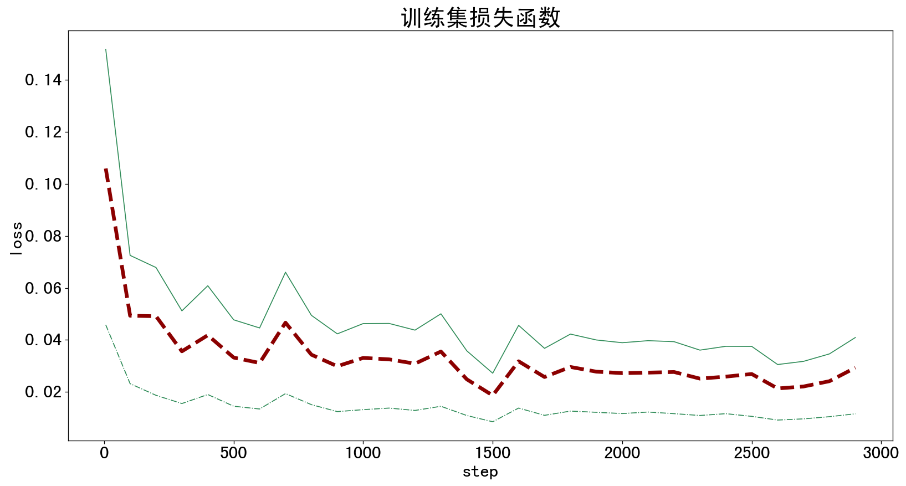
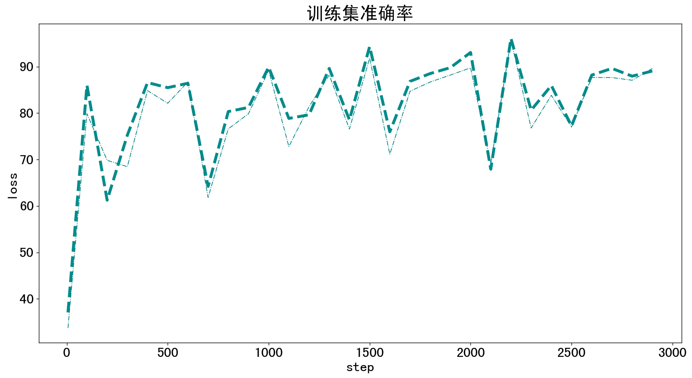
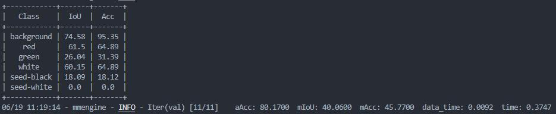
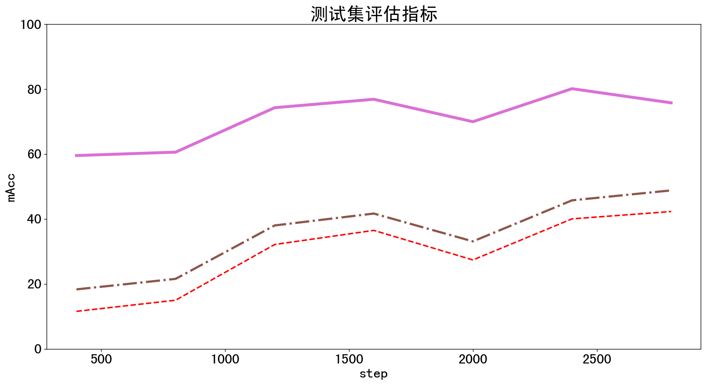
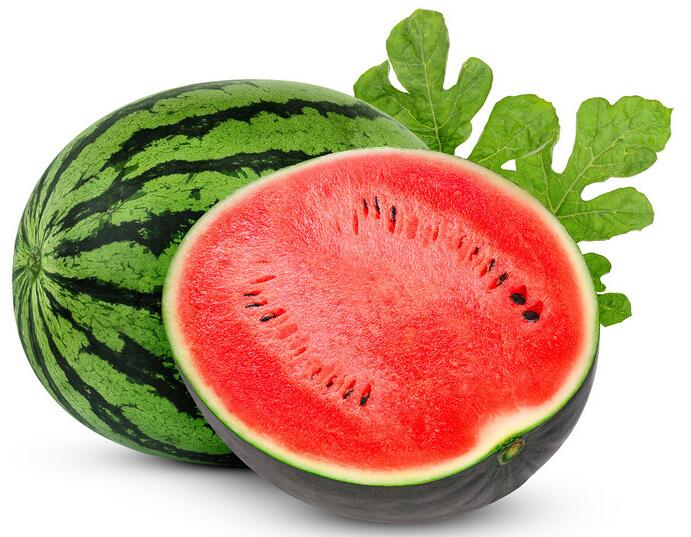
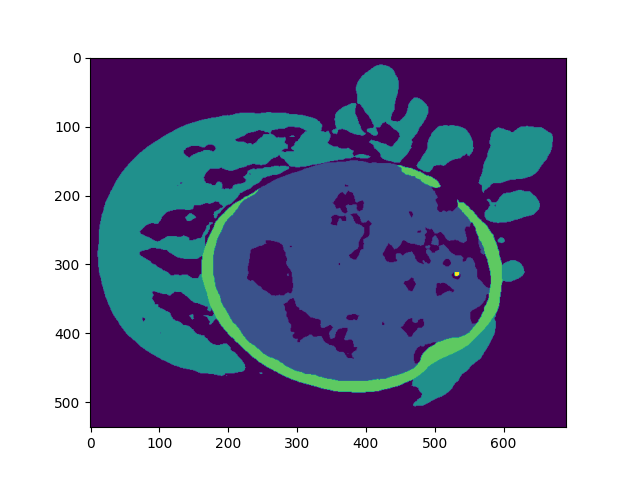

# 训练过程
## 准备阶段
1. [config文件](./pspnet-Watermelon_20230618.py)
2. [dataset文件](./WatermenlonDataset.py)

## 开始训练
`python train.py`

## 可视化训练日志
`python TrainingLog.py`

# 训练结果
训练日志的csv文件在Result_in_Training中
## 训练集结果：
### 训练过程中loss变化曲线

### 训练过程中训练集准确率变化曲线

## 测试集指标：
### 最好模型的评价指标具体数字

### 训练过程中测试集指标变换曲线

# 个人数据上推理测试
## 图像上的分割
### 输入图像

### 推理结果

## 视频上的分割
[输入视频](./TestDataSet/watermelon.mp4), [推理结果](./TestDataResults/watermelon_out.mp4)

## 测试集指标：

# 个人数据上推理测试
## 图像上的分割

## 视频上的分割
输入视频
推理结果

